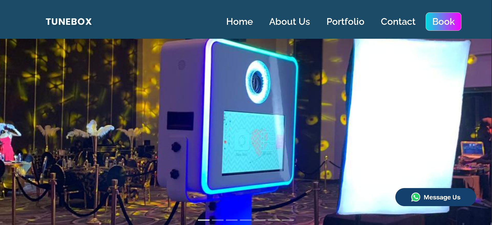

<!-- Animated Header -->

  

<!-- Dynamic Capabilities -->

  

  <em>Detail driven engineering. Clean code. Reliable, scalable services.</em>

<!-- Socials -->

  
  
  
  

---

<h2 align="center">About Me</h2>

I'm a full-stack software engineer who enjoys turning ideas into reliable, useful software. I care about clean architecture, clear communication, and shipping products that solve real problems.

<!-- TODO: personal details below are placeholders, replace with your real story -->
My workflow centers on understanding the problem first, then building the simplest system that delivers value. I work across frontend and backend, and I am always learning better ways to design, build, and maintain software.

I take ownership of what I build, from the first commit to production. I review thoughtfully, communicate tradeoffs clearly, and keep learning in public.

I'm interested in teams and projects that value thoughtful engineering, good collaboration, and long-term quality over rushed solutions.

---

<h2 align="center">What I Do</h2>

I design and build software that turns ideas, business processes, and operational challenges into reliable digital systems.

| Area | What I Build | Business Impact |
|:-----|:-------------|:----------------|
| **Web & Mobile Applications** | Customer-facing web apps, dashboards, and mobile-first platforms | Turns ideas into accessible, production-ready products |
| **Backend & APIs** | REST APIs, integrations, automation, and data workflows | Connects systems and removes repetitive manual work |
| **Automation & Integrations** | Reporting, notifications, third-party API integrations, and data sync | Reduces errors, saves time, and keeps teams focused |
| **Custom Software** | Internal tools and tailored solutions | Replaces manual processes with dependable systems |

> *I focus on understanding the real problem first, then building the simplest reliable system that delivers measurable value.*

---

<h2 align="center">Now Building</h2>

### Project Name - Working Title

Short description of the product or platform you are currently building, who it helps, and why it matters.

**Current focus:** Focus area one · Focus area two · Focus area three

---

<h2 align="center">Open To</h2>

- **Full-time and graduate engineering opportunities** where I can contribute across frontend, backend, full-stack, and product engineering.
- **Freelance projects** helping businesses turn operational challenges and product ideas into reliable digital systems.
- **Early-stage teams and side projects** where I can add value across the stack.
- **Remote, hybrid, and onsite opportunities** within Kenya and internationally.

> *I bring a problem-first mindset, adapt quickly to unfamiliar domains, and take ownership from system design through production delivery.*

---

<h2 align="center">Design Patterns & Engineering Principles</h2>

| Principle | How I Apply It |
|:----------|:---------------|
| **Understand before building** | I define the real problem, constraints, and desired outcomes before choosing a solution. |
| **Keep it simple** | I prefer clear architectures and focused abstractions over unnecessary complexity. |
| **Build for reliability** | I treat correctness, security, and failure handling as core product requirements. |
| **Write code for humans** | I favor readable code, good naming, and documentation that helps the next person. |
| **Ship and iterate** | I deliver working software early and improve it with real feedback and usage. |
| **Learn in public** | I share what I learn, ask good questions, and grow through feedback. |

> *The goal is not merely to ship software, but to build the right system and keep it valuable over time.*

---

<h2 align="center">Tech Stack</h2>

<!-- Sample stack only: replace with the tools you actually use -->

  

### Stack Breakdown
- **Frontend:** React, TypeScript, JavaScript, Tailwind CSS, HTML, CSS
- **Backend & APIs:** Node.js, Express, Python, REST APIs
- **Database:** PostgreSQL, MySQL, MongoDB
- **DevOps & Tools:** Git, GitHub, Docker, Figma

---

<h2 align="center">Featured Projects</h2>

<!-- Projects are placeholders: replace with your real projects, links, and metrics -->

### Tunebox Photobooth System - Photo Booth Business Platform

  

A complete photo booth business platform for Tunebox Photobooth, combining a client-facing website with an admin dashboard for booking management, portfolio content, and customer communication.

<ul>
  <li>Built a custom Django user system with email-or-username authentication and role-based accounts (regular, subscriber, moderator) that keep photo galleries scoped to each user.</li>
  <li>Automated the booking workflow end-to-end: clients request appointments, admins accept them from the dashboard, and clients receive automatic HTML email confirmations.</li>
  <li>Built the portfolio around multi-image uploads, category organization, ownership-checked edits and deletes, and S3-backed media storage via django-storages and Pillow.</li>
  <li>Shipped service pages for printing, branding, and photo templates alongside a live contact form wired to SMTP email.</li>
</ul>

<strong>Built with:</strong> Django · Python · Bootstrap · SQLite · Pillow · django-storages (S3) · SMTP

  
  

### Smart Residential Management System - Residential Property Operations Platform

  

A production residential management system for Global Smartspaces Residentials that brings property operations, tenant management, financials, and staff workflows into one role-based platform.

- Built role-based portals for tenants, staff, and accountants with property, unit, and lease management, maintenance requests, visitor management, applications and waitlist, and a support desk that keeps residents and staff on one system.
- Automated the money side end-to-end: invoicing, payment tracking, arrears, deposits, chart of accounts, journal entries, and financial reports, with Stripe online payments and an NCBA bank webhook that captures verified events into a review queue before any accounting record is posted.
- Added operational controls including an audit trail, bulk import, user and profile security, team chat, broadcast and comms hub, tasks and checklists, plus a documented backup and recovery runbook.

**Built with:** React · Vite · Tailwind CSS · Supabase (PostgreSQL, Auth, Storage, Edge Functions) · Stripe · React Query

  

### Project Three - What It Does

Short description of the project, the problem it solves, and who it helps.

- Bullet point on a key feature or technical decision.
- Bullet point on a measurable result, such as performance, tests, or users.
- Bullet point on what you learned or did differently.

**Built with:** Python · FastAPI · React · PostgreSQL

  

---

<h2 align="center">GitHub Stats</h2>

<table>
  <tr>
    <td>
      
    </td>
    <td>
      
    </td>
  </tr>
</table>

  

---

<h2 align="center">Credibility</h2>

| Area | Evidence |
|:-----|:---------|
| **Professional Experience** | Placeholder: describe the client work or roles you have delivered. |
| **Technical Validation** | Placeholder: mention testing coverage, load test results, or shipped products. |
| **Security & Reliability** | Placeholder: list auth, validation, rate limiting, or reliability patterns you use. |
| **Education** | Placeholder: degree, school, and year. |
| **Certifications** | Placeholder: list certifications and course completions. |

---

<h2 align="center">Beyond Code</h2>

- I support fellow developers through practical advice, knowledge sharing, and occasional mentorship.
- I value empathy, transparency, openness, and emotional intelligence when collaborating with others.
- I care about building tools that help people and businesses operate more effectively.
- Outside engineering, I enjoy sports, music, nature, films, and series.

---

<h2 align="center">Let's Build Something</h2>

  <strong>Have a role, business challenge, or product idea? Let's discuss how I can contribute.</strong>

  
  
  

  

  

